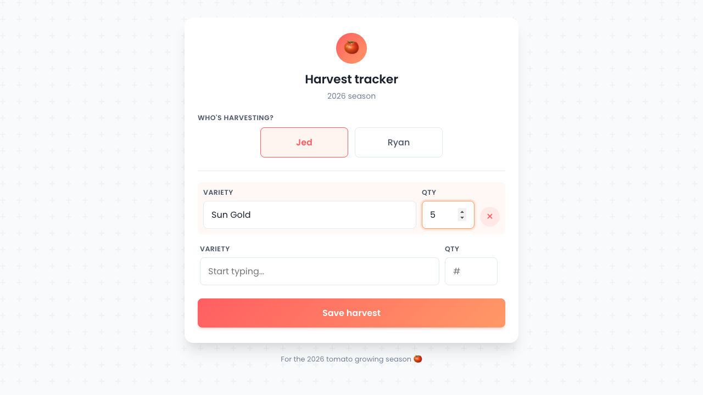
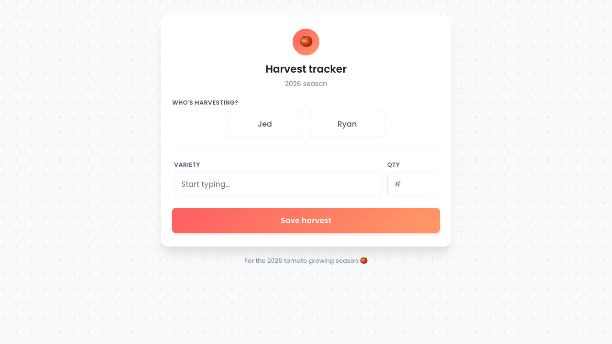

# Demo 09 — Harvest SPA

Verifies the new Vite + Svelte harvest form against the live GAS endpoint.

## What's verified

1. SPA boots, fetches `listVarieties` (empty for now — `2026 Seedlings` not yet seeded), renders the form without errors.
2. Two-row entry pattern: filling the last row's variety + qty auto-appends a new empty row.
3. `submitHarvest` round-trips through `/exec` and writes to the `Harvest Data` tab. Server returns `{rowsAdded: 1}`.
4. Form resets after a successful submit; success toast appears.

## Visual evidence

### 1. Empty boot


Form rendered cleanly: tomato gradient badge, harvester chips (Jed / Ryan), single empty entry row, gradient submit button.

### 2. Filled (Jed selected, "Sun Gold ×5")



Selected harvester chip is tinted; filled row gains an orange tint + remove button (×); fresh empty row appended below.

### 3. After submit



Form reset to its empty state after a successful POST. (The transient green "Saved — 1 row added." toast dismisses after 4s; this snapshot is post-toast.)

## Live verification (Playwright snapshot, just after submit)

```
- main:
  - generic:
    - Harvest tracker / 2026 season
    - Who's harvesting?  (Jed) (Ryan)
    - VARIETY [Start typing…]   QTY [#]
    - Save harvest
  - Saved — 1 row added.
```

`Saved — 1 row added.` matches the `submitHarvest` server response (`{rowsAdded: 1}` — see `gas/api.gs` `appendHarvest_`).

## Auth boundary (negative tests, from earlier deploy demo)

Confirmed in `demos/05-gas-deploy.md`:

- `submitClaim` with `HARVEST_BYPASS_TOKEN` → `403 NO_ACCESS`
- `submitHarvest` with `CLAIMS_BYPASS_TOKEN` → `403 NO_ACCESS`

The harvest SPA bundle only ever embeds `VITE_HARVEST_TOKEN`, so a leaked bundle can only call `ping`, `listVarieties`, `submitHarvest`.

## Deploy target

GitHub Pages: https://jedwood.github.io/tomato-tracker/

Pages serves from master branch root. `scripts/deploy-ghpages.mjs`:

1. Builds `spa/` → `spa/dist/`.
2. Greps build for canary strings.
3. Copies `dist/*` into the repo root.
4. Stages, commits, pushes — Pages picks up within ~1 min.

## Run the demo

```bash
cd spa
npm install               # first time
npm run dev               # http://localhost:5275/
# Open the URL, pick a harvester, fill a variety + qty, click Save.
# Check the Harvest Data tab in the spreadsheet for the new row.
```
