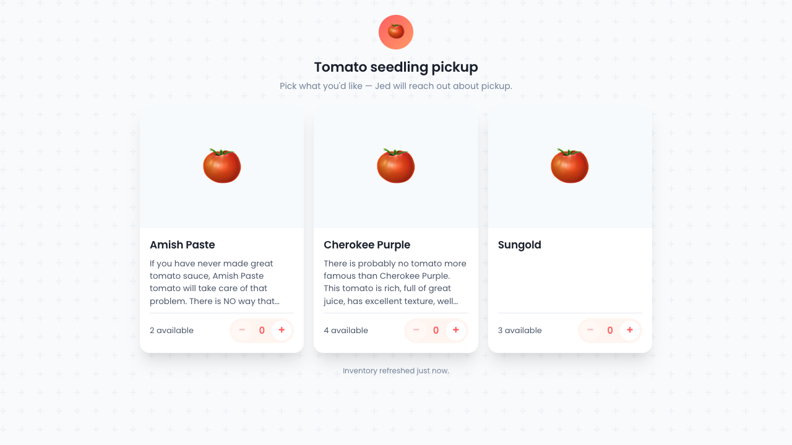
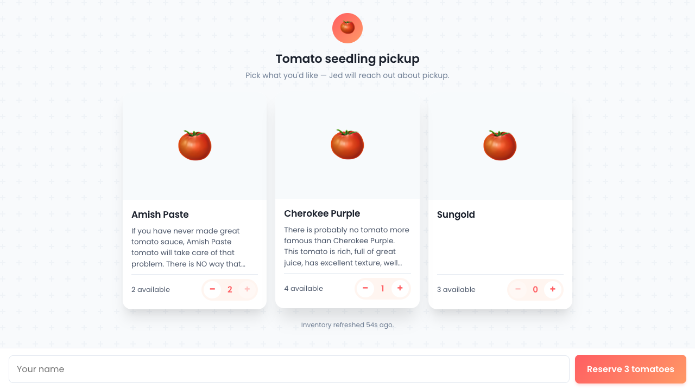
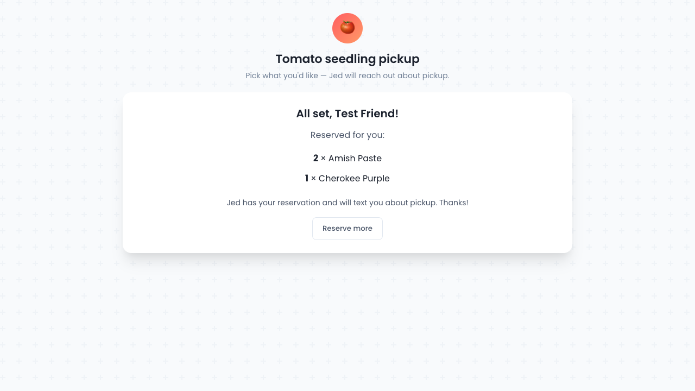

# Demo 12 — Claim SPA

Verifies the family-facing seedling claim form against the live GAS endpoint.

## URL

Live at https://jedwood.github.io/tomato-tracker/claim.html

## What's verified

1. SPA boots, fetches `getInventory` (joined Varieties × 2026 Seedlings, only varieties with `Available > 1`), renders one card per variety.
2. Each card shows photo (or 🍅 placeholder), variety name, type/color meta, truncated description, and stepper.
3. Stepper enforces both `0` floor and `available` cap. Sticky bottom bar appears with name input + "Reserve N tomatoes" CTA once any qty is > 0.
4. Submit calls `submitClaim`, server appends rows under a script lock, decrements `Available`, and returns `{claimId}`.
5. Success state replaces grid with a confirmation card listing reservations + a "Reserve more" button to start over.
6. `STOCK_CHANGED` race: handler refreshes inventory and outlines conflict varieties in orange, prompting user to re-pick.
7. Polling: 150s interval + immediate refetch on `visibilitychange === 'visible'`.

## Visual evidence

### 1. Inventory loaded — three test varieties



Three cards (Amish Paste / Cherokee Purple / Sungold), photo placeholders (no Photo URLs yet — the photo-finder agent is running separately for that), descriptions clamped to 4 lines.

### 2. After picking 2 Amish Paste + 1 Cherokee Purple



- Amish Paste qty 2 (cap reached — `+` disabled, "2 available" matches qty)
- Cherokee Purple qty 1
- Sticky reservation bar appeared with name input + "Reserve 3 tomatoes" CTA
- "Inventory refreshed 54s ago." footer present

### 3. Successful submission



Success card with "All set, Test Friend!", reservation list (2 × Amish Paste, 1 × Cherokee Purple), pickup-coordination message, and "Reserve more" button.

## Backend verification

```bash
$ ./scripts/api_call.py readTab '["Seedling Claims"]'
{
  "Timestamp": "2026-05-05T23:03:44.000Z",
  "Name": "Test Friend",
  "Variety": "Amish Paste",
  "Quantity": 2,
  ...
}
{
  "Timestamp": "2026-05-05T23:03:44.000Z",
  "Name": "Test Friend",
  "Variety": "Cherokee Purple",
  "Quantity": 1,
  ...
}
```

Available counts dropped: Amish Paste 2→0 (vanished from inventory), Cherokee Purple 4→3.

## What still needs to happen before sending the URL out

- Jed fills in `Available` counts on the `2026 Seedlings` tab.
- Photo-finder agent (task #11) populates `Photo URL` on the `Varieties` master.
- Optional: tweak header copy / pickup coordination message.

## Run locally

```bash
cd spa
npm run dev
# open http://localhost:5275/claim.html
```
